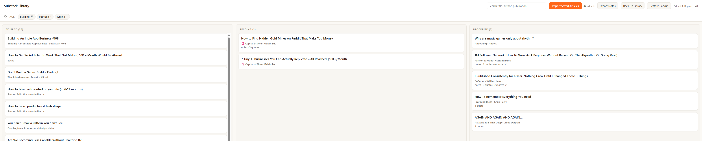
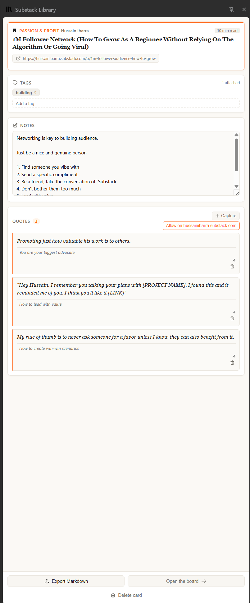

# Substack Library

Substack Library is a local-first Chrome extension to help you track and take notes on what you have saved on Substack.

## What it does

- Sync your existing saved articles. It reads the title, author, publication.
- Track your reading progress on a Kanban Board.
- Open up the extension on articles to automatically save them to your Board.
- Take notes in a side panel docked beside the article on its own page.
- Select text to keep it as a quote, and comment on the quotes.
- Export your notes as Markdown.
- Backup your Substack Library as a JSON so you can resume your reading on other devices.

## Demo

<video src="https://github.com/philliplagoc/Substack-Library/raw/main/screenshots/demo.mp4" controls muted playsinline width="100%"></video>

[Watch the demo](screenshots/demo.mp4).





Everything is stored locally in the browser (IndexedDB). There is no account and
no server.

## Install from source

```sh
cd extension
npm install
npm run build
```

Then open `chrome://extensions` (or `edge://extensions`), turn on Developer
mode, choose **Load unpacked**, and select `extension/.output/chrome-mv3`.

## Develop

```sh
cd extension
npm run dev      # live-reloading dev build
npm test         # vitest
npm run compile  # type-check only
```

See [CONTRIBUTING.md](CONTRIBUTING.md) for more, and
[`extension/MANUAL-CHECKS.md`](extension/MANUAL-CHECKS.md) for the checks that
tests do not cover.

## Project layout

```
extension/
  src/
    entrypoints/   background service worker, board tab page, side panel
    domain/        pure logic: cards, articles, Markdown, quotes, sync
    db/            IndexedDB schema and access (Dexie)
    substack/      the code that reads Substack's DOM
      __fixtures__/  captured pages the parser tests run against
    ui/            shared React components
```

## License
MIT. See [LICENSE](LICENSE).
